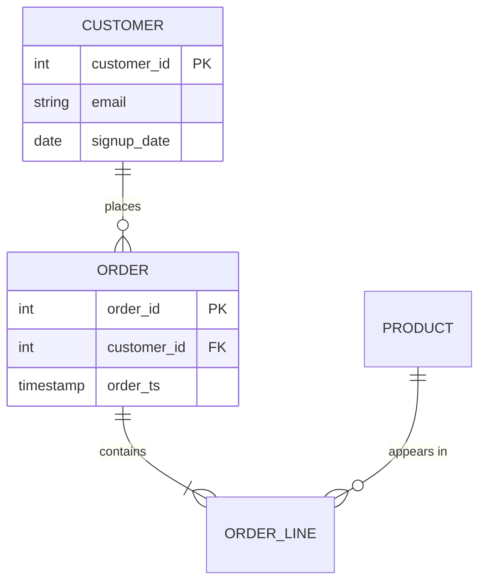

# Data Profiling & Mapping

You cannot model data you don't understand. Profiling is the **one-time investigation** that turns "here's a CSV/table" into "here's exactly what's in it and how it should be shaped." Do this before drawing a single ER box.

## Where this sits (boundaries)

- **vs. [[data-reliability]] (data-quality):** profiling is exploratory, run once to *understand* the data. Data-quality is recurring, run every load to *guard* it. Same checks, different lifecycle stage.
- **vs. [[data-modeling]] (schema-design):** profiling *discovers the actual data*; schema-design *chooses the model* (star/SCD/grain) using what you found here.
- **Reuse the code:** `utils/quality.py` and `utils/keys.py` already implement most of these checks — call them, don't re-implement.

## The profiling checklist — run all of it

### Structure
- [ ] Row count and column count
- [ ] Column names and declared vs. actual data types (strings hiding numbers/dates?)
- [ ] Encoding, delimiter, header presence for files

### Completeness
- [ ] Null / empty-string / sentinel (`-1`, `9999`, `"N/A"`, `"unknown"`) rate per column
- [ ] Columns that are entirely null or entirely constant (drop candidates)

### Cardinality & keys
- [ ] Distinct count per column
- [ ] Candidate unique key — single column, or composite (`utils/keys.find_unique_key`)
- [ ] Duplicate rows on the candidate key (`utils/keys.get_duplicate_rows`)

### Distributions & ranges
- [ ] Min / max / typical range for numerics and dates (catch impossible values: negative age, future timestamps)
- [ ] Top-N frequency for categoricals (spot typos, casing inconsistency, unexpected categories)
- [ ] Outliers worth flagging before they distort models

### Relationships
- [ ] Foreign-key candidates: which columns join to which other tables, and do the values actually match (orphan rate)?
- [ ] Grain: what does one row represent? (one order? one order-line? one order-per-day snapshot?)

## Source-to-target mapping

Once profiled, map each source field to its intended target. This table is a deliverable and feeds modeling directly.

| Source field | Type (actual) | Null% | Target field | Target type | Transform | Notes |
|---|---|---|---|---|---|---|
| `cust_id` | string | 0% | `customer_id` | INT64 | cast, validate FK | primary key |
| `signup_dt` | string | 2% | `signup_date` | DATE | parse `MM/DD/YYYY` | 2% unparseable → quarantine |
| `stat` | string | 0% | `status` | STRING | lowercase, map codes | values: A/I/P → active/inactive/pending |

## ER diagram

With keys and relationships known, draw the ER model. Prefer text-based (Mermaid) so it lives in the repo and diffs cleanly:

Capture per entity: primary key, foreign keys, grain, and cardinality of each relationship (`||--o{` = one-to-many, optional).

## Output & hand-off

A profiling pass produces three artifacts: the **profile report** (the checklist findings), the **source-to-target map**, and the **ER diagram**. These feed:
- Choosing the model → [[data-modeling]] (schema-design)
- Standing up recurring checks from what you found → [[data-reliability]] (data-quality)
- Architecture sizing → [[data-architecture]]

See the lifecycle overview in [[data-lifecycle]].
